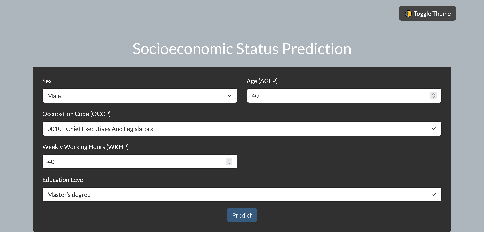
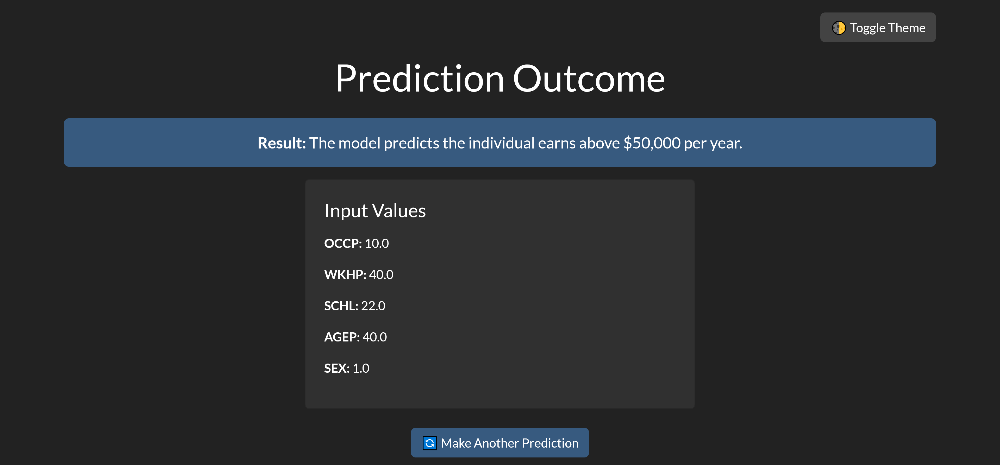

# Msc_Data_Science_Project

**Socioeconomic Status (SES) Prediction Web Application**

**Project Overview** 

The project implements an end-to-end machine learning application capable of predicting an individual’s socioeconomic status (SES) based on demographic and employment attributes. It classifies whether the individual earns above or below $50,000 per annum with the aid of different machine learning models. The model, which was ultimately deployed, is Gradient Boosting and was chosen due to its high accuracy and AUC-ROC value that has been realized here of 80% and 0.87 respectively when tested on the sample data used in this project ensuring strong predictive performance in the real world.

**Project Structure**

app.py — Code for Flask application 

final_gradient_boosting_model.pkl.gz — Compressed trained model (saved in the main project folder).

index.html, base.html and result.html — HTML templates for the web interface (inside /templates/ folder).

README.md — Project overview and instructions.

requirements.txt — Python dependencies list.

**How to Run Locally**

1. Clone the Repository
```python
git clone https://github.com/Mustaphayinka/Msc_Data_Science_Project.git
cd Msc_Data_Science_Project
```
2. Install Required Packages
```
pip install -r requirements.txt
```
3. Run the Flask Application
```
python app.py
```
4. Access the Web App
Open your browser and navigate to:
http://127.0.0.1:81

**Features**

Predict SES using five key demographic/employment attributes:

Occupation (OCCP)

Work Hours per Week (WKHP)

Education Level (SCHL)

Age (AGEP)

Sex (SEX)

Clean, Bootstrap-styled user interface (online Bootstrap CDN used).

Real-time predictions without saving any user data.

Fully interactive experience from input to prediction.


**Live Testing URL**
The deployed application can be tested here(for demonstration purposes only):
[https://440c7e70-de25-4082-84c2-2fa901e4a013-00-30eutk3rkk8n7.janeway.replit.dev/]

*Note:*
This deployment is for academic demonstration only and is ethically compliant (no real user data is collected or stored).

*Key Highlights*
Dataset: Part of the Folktables dataset taken from the American Community Survey (ACS).
Best Model: Gradient Boosting Classifier. 

Performance Metrics: 

Accuracy: 80% 

AUC-ROC: 0.88 

Deployment Platform: Replit

Future Improvements Expand model detail SES attributes.

Improve feature engineering 

Upgrade hosting to production environment e.g, AWS, Heroku for scalable use


Here’s a preview of the deployed **Socioeconomic Status Prediction** web application:

### Homepage


---

### Result Page



*License*
This project is licensed under the MIT License.


